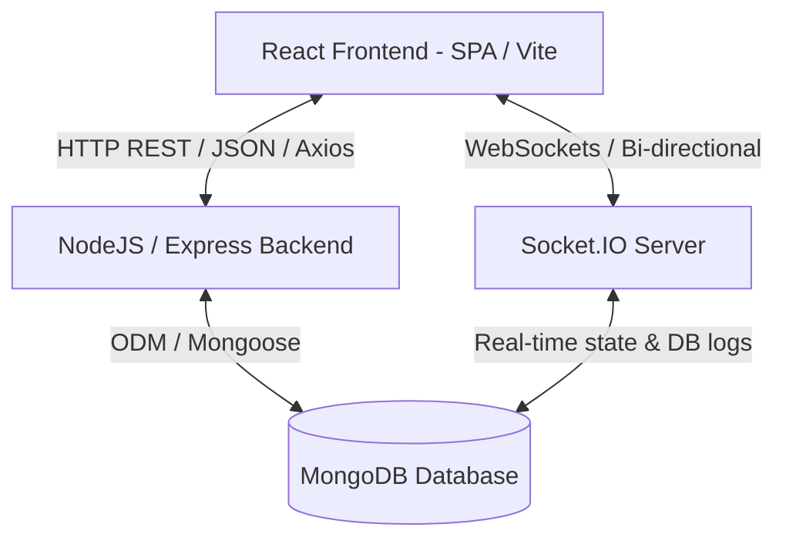

# DevConnect: Interview Preparation Guide

Welcome to your ultimate interview guide for **DevConnect**! This document breaks down the entire application architecture, database schemas, advanced algorithms, and real-time networking so you can answer any developer or architectural question with confidence.

---

## 💡 The 30-Second Project Pitch
*How to pitch DevConnect when an interviewer asks, "Tell me about your project."*

> "I built **DevConnect**, a full-stack collaboration platform designed specifically for software developers. It allows users to build rich profiles showcasing their skills, post their projects, search for teammates with matching skillsets, and request to team up. Once collaboration requests are accepted, developers can chat in real time, check online status, and see typing indicators. I built it using the **MERN stack (MongoDB, Express, React, Node.js)** with **Socket.IO** for real-time WebSockets, and implemented features like custom in-memory rate limiting and a custom trending algorithm based on popularity and time decay."

---

## 🗺️ High-Level Tech Stack & Architecture

DevConnect is a full-stack **Single Page Application (SPA)** that follows a client-server architecture:



### 1. The Frontend (React, Vite, Tailwind CSS)
* **Vite**: A modern frontend build tool that is significantly faster than Create React App. It uses native ES modules to compile code instantly in development.
* **React**: A component-based UI library. We use state, context, and custom hooks to build a responsive, reactive interface.
* **Tailwind CSS**: A utility-first CSS framework. It makes building clean, modern, responsive interfaces very fast without writing heavy CSS files.
* **Axios**: A promise-based HTTP client for making API requests. We use **interceptors** to manage authentication headers centrally.

### 2. The Backend (Node.js, Express, MongoDB)
* **Node.js**: A runtime environment that runs JavaScript code outside the browser (on the server).
* **Express.js**: A lightweight framework on top of Node.js for managing routing, middleware, and request-response cycles.
* **MongoDB**: A NoSQL document-based database. Data is stored in JSON-like structures called documents, which makes it perfect for dynamic and nested data (like developer profiles).
* **Mongoose**: An Object Data Modeling (ODM) library for MongoDB. It allows us to define strict schemas, run validations, and write clean database queries in Node.js.
* **Socket.IO**: A library that enables real-time, bi-directional, event-based communication between the web browser and the server.

---

## 🗄️ Database Design & Models (MongoDB / Mongoose)

MongoDB is a **NoSQL document database**. Instead of tables and rows (like MySQL), we use **collections** and **documents**. We have 6 key collections:

### 1. User Schema (`User.js`)
Stores developer information (username, email, password hash, bio, skills, online status, and bookmarks).
* **Embedded vs. Referenced Data**:
  * **Embedded Schema**: We embed `socialLinksSchema` (GitHub, LinkedIn) inside the User document because they are small, static, and always retrieved together with the user.
  * **Referenced Schema**: We reference `savedProjects` as an array of Object IDs pointing to the `Project` collection. This prevents the User document from becoming too large and allows projects to be updated independently.

### 2. Project Schema (`Project.js`)
Stores project showcase info: Title, Description, Tech Stack, Github links, Thumbnail, Likes, Creator, Category, and Difficulty.

### 3. Comment Schema (`Comment.js`)
Matches a User ID to a Project ID, storing the text comments posted on project cards.

### 4. TeamRequest Schema (`TeamRequest.js`)
Stores collaboration requests between developers. Contains `sender`, `receiver`, `project`, and `status` (`'pending'`, `'accepted'`, `'rejected'`, `'cancelled'`).

### 5. Message Schema (`Message.js`)
Stores private chat messages between two developers. Keeps track of `sender`, `receiver`, `content`, `read` (boolean), and `readAt` (date).

### 6. Notification Schema (`Notification.js`)
Stores updates like "User A liked your project" or "User B sent a team-up request" so they can be shown in the user's notification bell.

---

### 🚀 What is Database Indexing? (Crucial Interview Topic)
In `User.js`, you'll see:
```javascript
userSchema.index({ name: 1 });
userSchema.index({ skills: 1 });
userSchema.index({ techStack: 1 });
```
#### 💡 Simple Example / Analogy:
Imagine a book with 1,000 pages. If you want to find the word "React", you have to read page-by-page (this is a **Collscan** or Collection Scan in databases). But if the book has an **Index** in the back, you look up "React" and jump directly to page 845 (this is an **Index Scan**).
* **Why we use it**: By indexing `skills` and `techStack`, search operations (like finding developers who know "Node.js") are lightning fast, even if we have millions of users.
* **Trade-off**: Indexes make search (Read) faster but make write/update operations slightly slower because MongoDB has to update the index tree every time a user edits their skills.

---

## 🔒 Security & Authentication (JWT + Bcrypt)

Our authentication system is secure and industry-standard. Here is how signup/login and session state work:

```
[Client]                                            [Backend]
   |--- 1. POST /api/auth/login (Credentials) -------->|
   |                                                   |-- A. Hash password & compare
   |                                                   |-- B. Generate JWT signed with Secret
   |<-- 2. HTTP 200 (JWT + User Info) -----------------|
   |
   |--- 3. GET /api/projects (Header: Bearer Token) -->|
   |                                                   |-- C. authMiddleware decodes JWT
   |                                                   |-- D. Attaches req.user, processes query
   |<-- 4. HTTP 200 (Project List) --------------------|
```

### 1. Password Hashing (Bcrypt)
We **never** store passwords in plain text. If a hacker steals the database, plain passwords would expose users.
* We use a Mongoose **pre-save middleware hook**:
  ```javascript
  userSchema.pre('save', async function (next) {
    if (!this.isModified('password')) return next();
    const salt = await bcrypt.genSalt(10);
    this.password = await bcrypt.hash(this.password, salt);
    next();
  });
  ```
* **Salt**: A random string added to the password before hashing. Even if two users have the same password (`123456`), their hashes will be completely different because of unique salts.
* **Select False**: In the schema, `password: { type: String, select: false }` ensures that whenever we query a user (e.g., in user directories), the password hash is excluded by default unless we explicitly request it.

### 2. JSON Web Token (JWT)
* **What is it?** A JWT is a self-contained, digitally signed string representing user data. It consists of three parts: Header, Payload (contains the user ID), and Signature.
* **Signature**: Built by encrypting the header and payload with a secret key (`JWT_SECRET`) stored on the server. If a user modifies the payload, the signature becomes invalid, and the server rejects it.
* **JWT Expiration**: Set to `7d` (7 days). If a token is compromised, it automatically expires, limiting security risks.

### 3. JWT Middleware: `protect` vs. `optionalProtect`
* **`protect`**: Extract token from the headers (`Authorization: Bearer <token>`). Verify it with `jwt.verify()`. If missing or invalid, throw a `401 Unauthorized` error. Used for sensitive routes (editing profile, joining a team, sending chat).
* **`optionalProtect`**: If a token is provided, verify it and attach `req.user`. If no token is provided, do NOT throw an error—let the request continue as a guest. Used on pages like project feeds where public users can see content, but logged-in users get extra buttons (like "Like" or "Bookmark").

---

## 🛡️ Custom In-Memory Rate Limiter
We wrote a lightweight, dependency-free rate limiter middleware in `rateLimiter.js`.

### How it works:
1. It creates an in-memory `Map` storing the user's IP address, the number of hits they made, and a reset timestamp.
2. Every time a request comes in:
   * If the IP is new, start a tracking window (e.g., 15 minutes, 100 max hits).
   * If the window expired, reset their hit count.
   * If the hit count exceeds `max`, return HTTP status `429 Too Many Requests`.
3. It sets response headers:
   * `X-RateLimit-Limit`: Maximum requests allowed.
   * `X-RateLimit-Remaining`: Requests left in the current window.
   * `X-RateLimit-Reset`: UNIX timestamp when the counter resets.
4. **Interval Cleanup**: Every 10 minutes, a background loop clears expired records from memory to prevent memory leaks (`store.delete(key)`). We use `.unref()` so Node.js can terminate normally without waiting for this interval to clear.

---

## 📈 Advanced MongoDB: The Trending & Feed Aggregation
In `projectController.js` (inside `getAllProjects`), we use a custom **MongoDB Aggregation Pipeline** instead of standard queries. This is a sequence of processing stages that lets us calculate values on the fly.

### The Pipeline Stages:
1. **`$match`**: Filters the projects list based on queries (category, search text, tech).
2. **`$lookup` (Users)**: SQL-style join that pulls the creator's username and avatar from the `users` collection.
3. **`$unwind`**: Flattens the array returned by `$lookup` into a single object.
4. **`$lookup` (Comments)**: Grabs all comments belonging to this project.
5. **`$addFields`**: Calculates new properties dynamically:
   * **`likesCount`**: `{ $size: '$likes' }` (length of likes array).
   * **`commentsCount`**: `{ $size: '$_comments' }` (length of comments array).
   * **`trendingScore`**: Hacker News/Reddit decay formula:
     $$\text{Trending Score} = \frac{\text{Likes Count}}{(\text{Hours since creation} + 2)^{1.5}}$$
     This ensures a project with 100 likes from last week drops down, while a new project with 10 likes from 2 hours ago jumps to the top!
6. **`$sort`**: Orders projects by latest date, total likes, or trending score.
7. **`$skip` & `$limit`**: Skips $(page - 1) \times limit$ documents and grabs the next $limit$ documents. This handles **Pagination** smoothly.
8. **`$project`**: Hides sensitive user fields (like email and password hashes) before sending the output to the frontend.

---

## 🔌 Real-Time Communication (Socket.IO Engine)

Our chat and real-time activity features run on **Socket.IO** (WebSockets) in `socketServer.js` and `SocketContext.jsx`.

### 1. Connection & Handshake Authentication
When the React app starts, if a user is authenticated, it opens a persistent WebSocket connection:
```javascript
const sock = io(SOCKET_URL, {
  auth: { token: localStorage.getItem(TOKEN_KEY) }
});
```
On the backend, we run socket authentication middleware:
* It reads the handshake token, validates the JWT, and saves `socket.userId = decoded.id`.
* It updates the user's online status in the database: `User.findByIdAndUpdate(userId, { isOnline: true })`.
* It broadcasts to all other developers: `socket.broadcast.emit('user_online', { userId })`.

### 2. Multi-Tab Support (Set Map Pattern)
If a developer opens DevConnect in 3 browser tabs, they have **3 different sockets** but only **1 user ID**.
* **How we handle this**: We store users in a map of Sets: `const onlineUsers = new Map();` (Mapping `userId` to a `Set` of `socketId`s).
* **Adding**: When a socket connects, we add its ID to the user's set.
* **Disconnecting**: When a tab is closed, we remove that socket ID from the set. We *only* set the user offline in the database and emit `user_offline` when the set size is **0** (meaning all tabs/connections have been closed).

### 3. Room Management
We segment traffic using **Rooms** to avoid broadcasting private messages to everyone:
* **Private Chat Rooms**: Created with `getPrivateRoom(userA, userB)`. Under the hood, this combines the two IDs alphabetically (e.g. `chat_123_456`). When they open a chat, both sockets join this room. When User A sends a message:
  ```javascript
  io.to(room).emit('receive_message', payload);
  ```
  This immediately delivers the message to both participants.
* **User Rooms**: Every user is joined to a room named after their User ID (`user_123`). This is perfect for notifications and status flags (like typing events or read receipts) because we can target a user across all their open tabs instantly.

---

## 🤝 Collaboration System (Team Requests)
The team-up feature helps developers request to join a project. This requires complex logic to prevent state bugs.

### The Team Request Checks (Duplicate Prevention):
Before creating a `TeamRequest`, we run 3 crucial checks:
1. **Outgoing pending check**: User A cannot send another request to User B if one is already pending.
2. **Incoming pending check**: User A cannot request User B if User B has already sent a request to User A. The system blocks it and tells them to respond to User B's request first.
3. **Already collaborating check**: If User A and User B have already accepted a request, we block any new requests. They are already teammates!

---

## ⚛️ Frontend Design & Optimization

### 1. Performance: Code Splitting
In `App.jsx`, we don't import pages statically. We use:
```javascript
const Chat = lazy(() => import('./pages/Chat.jsx'));
```
* **Why**: By using React's `lazy` and `Suspense`, Vite bundles each page into its own small javascript file. The browser only downloads the "Chat" page code when the user clicks `/chat`, reducing the initial load time of the website.

### 2. Global State Context Layout
We wrap our app in a hierarchy of Context Providers:
```jsx
<ThemeProvider>
  <ToastProvider>
    <AuthProvider>
      <SocketProvider>
        <BrowserRouter>
...
```
* **Why this order?**: The `SocketProvider` needs to check if the user is authenticated and extract their JWT token. Therefore, `AuthProvider` must wrap `SocketProvider` so the socket can access the auth state.

### 3. Axios Interceptors
Instead of adding authorization headers to every single API call manually, we configure **interceptors** in `api.js`:
* **Request Interceptor**: Grabs the token from `localStorage` and appends it automatically to the headers.
* **Response Interceptor**: Listens to API responses. If the backend returns a `401 Unauthorized` (meaning the token expired or was modified), the interceptor automatically clears the localStorage and redirects the user to `/login`.

---

## 🎯 Top 5 Mock Interview Questions & Answers
*Practice speaking these answers out loud.*

### Q1: "How did you implement real-time chat? How did you handle user online status if they closed a tab?"
**Answer**:
> "I used **Socket.IO** for real-time bi-directional communication. On connection, the client sends their JWT in the handshake authentication details. The server validates the token and maps the user ID to their socket connection. 
> To support multi-tab operations, I mapped each User ID to a `Set` of active Socket IDs. When a socket connects, its ID is added to that User's set. When a tab is closed, only that single socket ID is removed. If the Set size reaches zero, we know the user has closed all tabs. At that point, we update their status in MongoDB to offline and broadcast a `user_offline` event to all other clients."

---

### Q2: "How did you structure authentication and password security?"
**Answer**:
> "I implemented a JWT-based authentication system. On the database level, I used **Mongoose pre-save hooks** with **bcrypt** to hash passwords with a salt factor of 10 before saving them. The schema is configured to not select the password by default to prevent accidental leaks.
> On successful login, the server signs a JSON Web Token containing the user's ID. On the frontend, an **Axios interceptor** automatically reads this token from local storage and appends it as a Bearer token in the headers of all outgoing requests. We also set up a response interceptor that catches any 401 token-expiry errors, logs the user out, and redirects them to the login page."

---

### Q3: "What is the most complex database query you wrote in this project?"
**Answer**:
> "The most complex query is the main project feed query. Instead of a basic find query, I built a custom **MongoDB Aggregation Pipeline**. 
> We filtered results dynamically, performed a `$lookup` to join creator profiles, and another `$lookup` on comments to calculate comment counts. We also calculated likes count dynamically by finding the size of the likes array. 
> Lastly, we computed a **Trending Score** on the database layer using a time-decay formula: Likes Count divided by hours since creation plus two, raised to the power of 1.5. This allows us to sort projects by popularity and freshness, and we handle pagination at the end using `$skip` and `$limit` stages for speed."

---

### Q4: "How did you protect your backend APIs from brute-force attacks or DDoS?"
**Answer**:
> "I built a custom, zero-dependency **rate limiting middleware** in Express. It stores client IP hits in an in-memory Map. Every time an IP makes a request, we increment their hit counter. If they exceed the limit within a 15-minute window, they receive a 429 status code. 
> We also set custom headers like `X-RateLimit-Remaining` to let clients know their limits. To prevent memory leakage, a background interval runs every 10 minutes to delete expired IPs, using the `.unref()` method to ensure the process can shut down cleanly."

---

### Q5: "Why did you choose MongoDB over a SQL database like PostgreSQL?"
**Answer**:
> "I chose MongoDB because of the flexible, document-based structure. In a developer collaboration app, user profiles can have highly variable and nested structures, like list of skills, portfolio links, and saved project bookmarks. Storing this as nested JSON document attributes is highly performant and intuitive. 
> Since we didn't require complex multi-row ACID transactions across highly rigid relational schemas, MongoDB’s scalability, indexing speeds for skill arrays, and document alignment with JavaScript objects made it the ideal fit for this rapid-development application."
